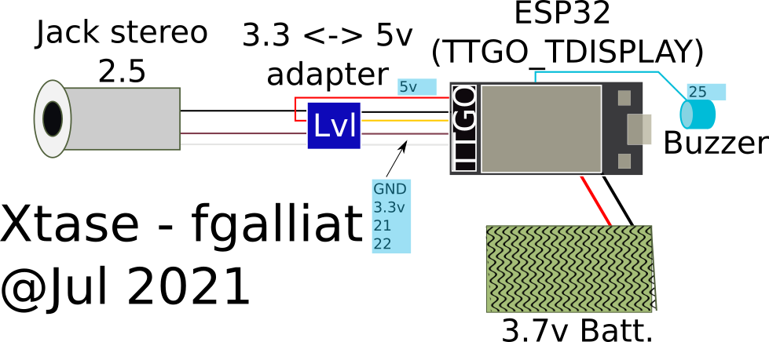

# XtsTiExpander v2
## XTase - fgalliat @Jul 2021

 - Batt. > ESP32 > Voltage Lvl converter > Ti wires

   |   |  |
   | ------------------------------------------------------------ | ------------------------------------------------------------ |

   (My TTGO T_Display is now able to make a Ti ScreenDump w/ ONLY Battery 3.7v as PWR !)

- **Main Features** :

   - [x] PWR on Batt
   - [x] Var Upload
   - [x] Var Download
   - [x] Screen dump
   - [X] SPIFFS
   - [x] Buzzer
   - [x] WiFi
     - [x] start, stop, conf
     - [x] telnet as Shell client (still a bug on close)
   - [x] 'tiaction' spe Var handle

- **Sub Features** :

   - [x] connect & send/receive bytes to Ti Voyage 200

   - [~] SerialTerm to V200

     - [x] Dummy mode
     - [~] CBL Keyb mode
     - [x] Raw

   - [ ] install minimal TI protocol
     - [x] requestScreen (try 1st w/ ISR mode -> seems to work)
     - [x] send KeyStrokes
     - [x] sendVar -> Ti
     - [~] readAsCBL <- Ti
     - [x] receiveVar <- Ti

   - [~] install hiLevel protocol

     - [~] actionVar receive (wip for longer than 64 data)
     - [x] play asBasica music String
     - [x] start WiFi ...

     /!\\ (recvNb == 0) -> no more : (recvNb == nbSent)

- **Shell Features** :
  - [x] shutdown esp32
  - [ ] ls (sorted + df) -> Stream
  - [ ] cat a var / hex var
  - [ ] cat a conf
  - [x] add WiFi conf
  - [x] start / stop WiFi
  - [x] screen dump
  - [x] builtin screen color scheme / swap

- **Commands set** : 

  | tiaction          | shell          | action                                      |
  | ----------------- | -------------- | ------------------------------------------- |
  | wifi:start        | wifistart      | start WiFi & telnet server                  |
  | wifi:stop         | wifistop       | close WiFi & telnet                         |
  |                   | wifipsk        | add WiFi config (interactive)               |
  |                   | wifidel        | delete all WiFi configs                     |
  | screen:swap       |                | swap OLED screen color scheme               |
  |                   | screen         | TiScreenDump                                |
  | get:<varName>     | send:<varName> | sends the <varName> to Ti                   |
  | play:<tuneString> |                | plays the <tuneString> onto Expander BUZZER |
  |                   | quit           | exit from Shell                             |
  |                   | halt           | shutdown Expander MCU                       |
  | list:             | ls [-s]        | list files to screen/curStream              |
  |                   | /send          | send tiVar to Expander (+ Ti - optional)    |
  |                   | hex:<varName>  | hexDump tiVar from Expander Storage         |
  |                   | ice            | restore 'menu' from Expander Storage        |

- **Needs set** : 

  - [x] Java telnet tool that works well w/ shell mode (mini-ncurses like / Gfx mode)
  - [~] Java var sending tool (from 86th byte of a .v2x / .92x file / from 1st byte of a .12 file)
  - [ ] Java var getting tool (as cat varName - need cat vn / dump vn in shell)
  - [ ] Dummy mode to shell (auto -or- requires 'login' cmd ?)

- **Known bugs** :
  - multiple sendVar on Shell mode (Wifi & Serial) / handleCalc mode too
    - bug is not in ti_handleCalc()
    - even if screendump between -> need to reboot to send again
    - can always send pop / never can send popbin after
    - pbm could be in ti_header ....
    - THAT WAS : static array return in ti_chk -> FIXED
