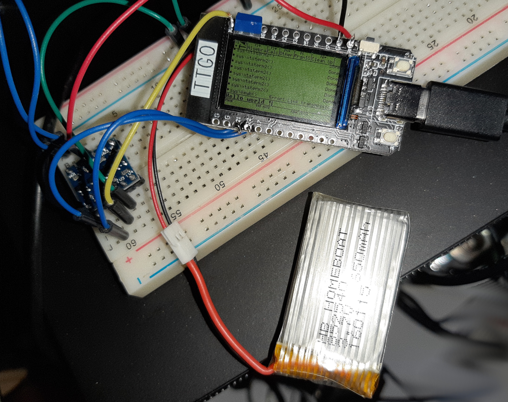
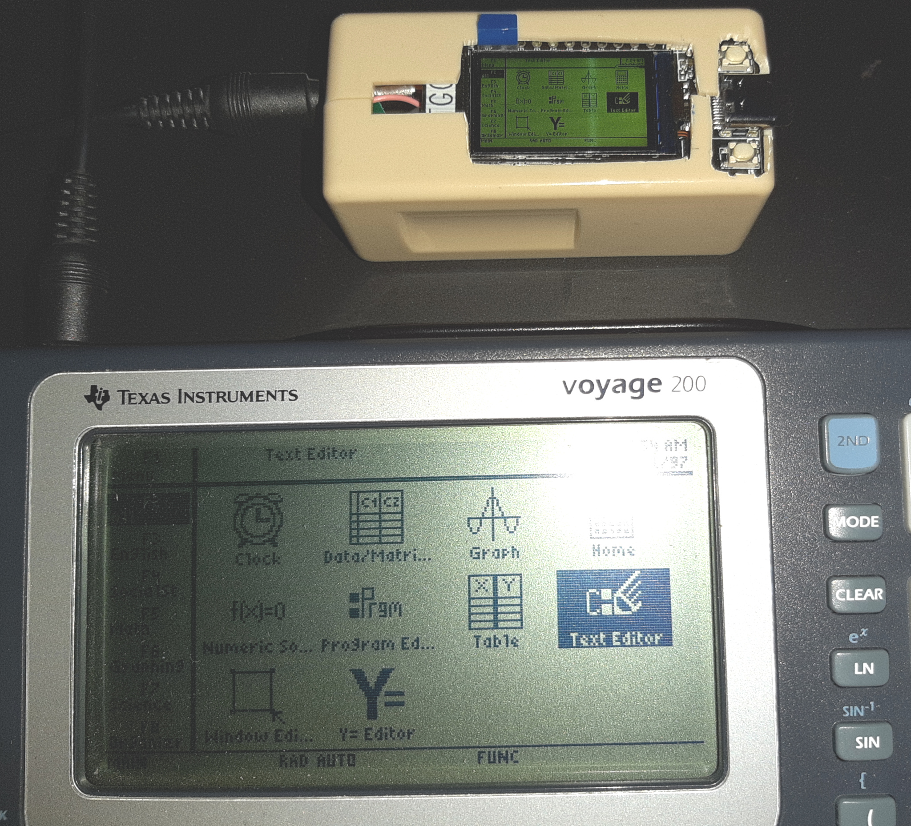

# XtsTiExpander v2
## XTase - fgalliat @Jul 2021

 - Batt. > ESP32 > Voltage Lvl converter > Ti wires

   |  |  |
   | ------------------------------------------------------------ | ------------------------------------------------------------ |

   (My TTGO T_Display is now able to make a Ti ScreenDump w/ ONLY Battery 3.7v as PWR !)

- **Main Features** :

- [x] PWR on Batt
- [x] Var Upload
- [ ] Var Download
- [x] Screen dump
- [~] SPIFFS
- [x] Buzzer
- [ ] WiFi
- [~] 'tiaction' spe Var handle

 - [x] connect & send/receive bytes to Ti Voyage 200

 - [~] SerialTerm to V200
   - [~] Dummy mode
   - [~] CBL Keyb mode
   - [x] Raw
   
 - [ ] install minimal TI protocol
   - [x] requestScreen (try 1st w/ ISR mode -> seems to work)
   - [x] send KeyStrokes
   - [ ] sendVar -> Ti
   - [~] readAsCBL <- Ti
   - [x] receiveVar <- Ti
   
 - [~] install hiLevel protocol
   - [~] actionVar receive (wip for longer than 64 data)
   - [x] play asBasica music String
   - [ ] start WiFi ...

   /!\\ (recvNb == 0) -> no more : (recvNb == nbSent)